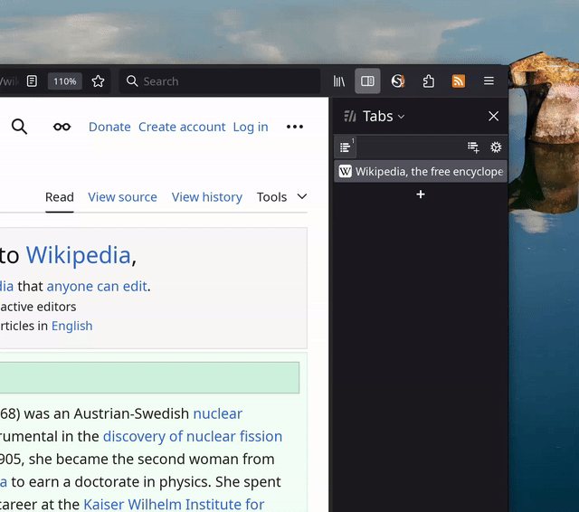

# RSS Launchpad Extension

Install from [Firefox Add-ons](https://addons.mozilla.org/en-US/firefox/addon/rss-launchpad-find-feeds-easy/).

## What is it?

RSS Launchpad is a minimalist extension for Firefox and Firefox mobile (and should be compatible with other browsers that support the Web Extensions format).
It provides a list of RSS/Atom feeds defined by websites as alternative sources in the document.

In total:

- The extension will extract all feeds from the active tab
- You can open these feeds with a RSS reader app or through a custom RSS reader web service

## Why use it?

First of all, I believe RSS is cool: it offers an independent, low-distraction way of reading and staying up-to-date
with interesting topics without the downsides of social media and modern algo-driven feeds, which often prioritize engagement and clickbait.

Sadly, RSS integration was removed long ago from all major browsers. Many websites (especially tech-related) still support it, though!
Sometimes, you may stumble upon an interesting blog post or newsletter - this extension will highlight whether that
site has an official RSS/Atom feed, allowing you to subscribe to more content later in your standalone
reader app. I personally enjoy using [Thunderbird](https://www.thunderbird.net), but it will work anywhere.

## Goals

- Indicate whether a website offers RSS/Atom feeds
- Should look nice & native to Firefox (including light/dark mode)
- Basic integration with 3rd-party readers via buildable URLs

## Non-Goals

- RSS reader capabilities
- Deeper integration with 3rd-party services
- Non-open subscription formats

## Technical Principles

- Less code is better, make it sound and statically typed
- Prefer native browser API
- Avoid adding dependencies unless necessary
- Minimize build step and code transformations
- Don't be invasive and use minimal required permissions

## How to contribute?

Feel free to send PRs. To start developing this extension you need:

- Up to date Firefox or compatible browser
- nodejs >= 20.x, npm >= 10.x, POSIX-compatible environment with bash
- run `npm install` and then `npm run start` to get started!

## TODOs

- [ ] i18n support
- [ ] Setup CI/CD, for now thigns are pretty manual
- [x] Add basic integration 3rd party openers? (Open via URL + query params)
- [ ] Add popular infer cases, like youtube with SPA navigation
- [ ] Maybe add support for in-addons settings menu, too

## Similar projects

- [Awesome RSS](https://github.com/shgysk8zer0/awesome-rss) - similar goal but abandoned, last commit in 2018

# Credits

Refer to CREDITS.md.
